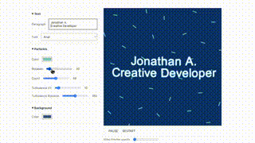

# 

 

**_Creative Developer & Full-Stack JS Engineer_**\
 🎨 Crafting web-apps & experiences with Three.js · WebGL · GLSL\
 💻 Stack: TypeScript · React · Svelte · Vue · Next.js · Node.js · Tailwind · etc...\
 🌐 [joeat.xyz](https://joeat.xyz)

 
 

<!-- OG_START -->
<table>
<thead>
		<tr><th>

	
<a href="https://joeat.xyz" aria-label="joeat.xyz website" target="_blank">website</a> | ...
</th><th>

	
<a href="https://jonathan-j8.github.io/sketch-sunlines/" aria-label="Sunlines website" target="_blank">website</a> | <a href="https://github.com/jonathan-j8/sketch-sunlines" aria-label="Sunlines repository" target="_blank">repo</a>
</th><th>

	
<a href="https://jonathan-j8.github.io/ilico.org/" aria-label="ilico website" target="_blank">website</a> | <a href="https://github.com/jonathan-j8/ilico.org" aria-label="ilico repository" target="_blank">repo</a>
</th></tr><tr><th>

	
<a href="https://jonathan-j8.github.io/optical-flow/" aria-label="Optical flow website" target="_blank">website</a> | <a href="https://github.com/Jonathan-J8/optical-flow.git" aria-label="Optical flow repository" target="_blank">repo</a>
</th><th>

	
<a href="https://jonathan-j8.github.io/windforlife/" aria-label="Windforlife website" target="_blank">website</a> | <a href="https://github.com/jonathan-j8/windforlife" aria-label="Windforlife repository" target="_blank">repo</a>
</th><th>

	
<a href="https://jonathan-j8.github.io/threejs-svg-parser/" aria-label="SVG parser website" target="_blank">website</a> | <a href="https://github.com/jonathan-j8/threejs-svg-parser" aria-label="SVG parser repository" target="_blank">repo</a>
</th></tr><tr><th>

	
<a href="https://jonathan-j8.github.io/play-creative/" aria-label="Play creative website" target="_blank">website</a> | <a href="https://github.com/jonathan-j8/play-creative" aria-label="Play creative repository" target="_blank">repo</a>
</th></tr>
</thead>
</table>
<!-- OG_END -->
