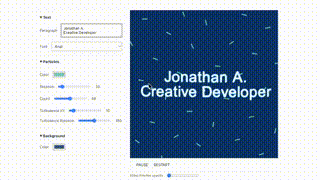

# 👋 Hi, I'm Jonathan

**_Creative Developer & Full-Stack JS Engineer_**

 🎨 Crafting web-apps & experiences with Three.js · WebGL · GLSL

 💻 Stack: TypeScript · React · Svelte · Vue · Next.js · Node.js · Tailwind · etc...

 🌐 [joeat.xyz](https://joeat.xyz)
 
 
 

<!-- OG_START -->
<table>
	<thead>
		<tr><th>
	

    joeat.xyz

</th><th>
	

    sunlines

</th></tr><tr><th>
	

    svg parser

</th><th>
	

    play creative

</th></tr><tr><th>
	

    windforlife

</th></tr>
	</thead>
</table>
<!-- OG_END -->
